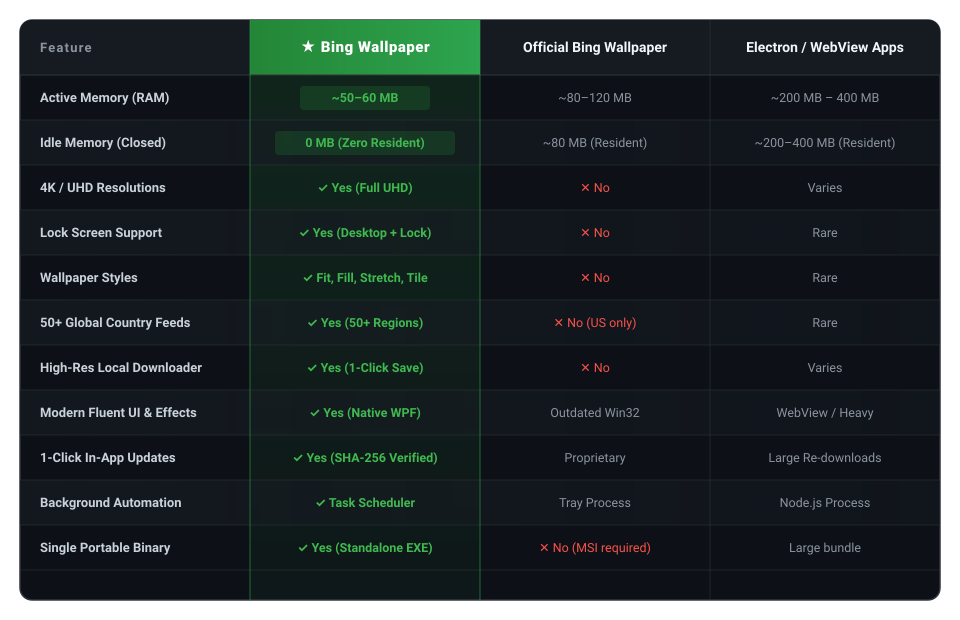

<div align="center">

<h1>
  
  AutoScape for Windows
</h1>

<p><b>Daily 4K Bing photography delivered to your Desktop & Lock Screen with near-zero resource consumption.</b></p>

<p align="center">
  <a href="https://github.com/Hamisoptimistic/Bing-Wallpaper/raw/main/AutoScape.exe?download=1">
    
  </a>
</p>

<p align="center">
  
  
  
  
  
  
</p>

<br />


</div>

---

## Why AutoScape?

Most wallpaper utilities wrap web frameworks like Electron or Chromium, permanently hogging **150 MB to 400 MB of RAM** just to change a wallpaper once a day.

**AutoScape for Windows is built natively:**
- **~50–60 MB Active RAM**: The lightweight WPF interface uses minimal memory while open.
- **0 MB Idle RAM**: The application exits completely when you close it. Automated background rotations are scheduled directly through Windows Task Scheduler—no background tray process or resident daemon needed.
- **100% Silent Execution**: Uses an invisible native runner to apply wallpapers in the background without terminal flashes or command prompt windows.
- **Zero-Console Standalone App**: Launches instantly via `AutoScape.exe` with no terminal pop-up.

---

## Features

<table>
  <tr>
    <td width="50%" align="center">
      <br />
      <b>⚡ Ultra-Low Memory Footprint</b>
      <br /><br />
      Built with native PowerShell and WPF. Uses only <b>~50–60 MB RAM</b> when open, and drops to <b>0 MB</b> when closed while Windows Task Scheduler manages background rotation.
      <br /><br />
    </td>
    <td width="50%" align="center">
      <br />
      <b>🎨 Modern Fluent UI & Hover Effects</b>
      <br /><br />
      Windows 11-inspired dark aesthetic featuring smooth card hover animations, reveal borders, rounded controls, custom dark title bar integration, and clean typography.
      <br /><br />
    </td>
  </tr>
  <tr>
    <td width="50%" align="center">
      <br />
      <b>🔄 Auto-Change via Windows Task Scheduler</b>
      <br /><br />
      Runs purely natively in the background. Choose between <i>On Login</i>, <i>1 min</i>, <i>Hourly</i>, <i>Every 6h</i>, or <i>Daily at 12:00 AM</i>.
      <br /><br />
    </td>
    <td width="50%" align="center">
      <br />
      <b>🖼️ Ultra HD / 4K & Multi-Monitor Fit</b>
      <br /><br />
      Pulls authentic 4K UHD imagery from Microsoft Bing. Choose your target (<i>Desktop</i>, <i>Lock screen</i>, or <i>Both</i>) and layout (<i>Fit</i>, <i>Fill</i>, <i>Stretch</i>, <i>Center</i>, <i>Span</i>).
      <br /><br />
    </td>
  </tr>
  <tr>
    <td width="50%" align="center">
      <br />
      <b>🌍 Global Region Support & Auto-Detect</b>
      <br /><br />
      Switch between 40+ countries and regions or let the app automatically match your current Windows locale.
      <br /><br />
    </td>
    <td width="50%" align="center">
      <br />
      <b>🚀 1-Click Cryptographically Verified Updates</b>
      <br /><br />
      Built-in update checker checks GitHub Releases, verifies SHA-256 integrity, and hot-swaps the application executable safely.
      <br /><br />
    </td>
  </tr>
  <tr>
    <td width="50%" align="center">
      <br />
      <b>💾 Dedicated Wallpaper Downloader</b>
      <br /><br />
      Save original, full-resolution 4K wallpaper images directly to your designated download folder with metadata and location info intact.
      <br /><br />
    </td>
    <td width="50%" align="center">
      <br />
      <b>🔄 1-Click Seamless In-App Updates</b>
      <br /><br />
      Click <b>Check for updates</b> to instantly check GitHub Releases. The app validates SHA-256 checksums, downloads the new version, and auto-restarts seamlessly—no installers or manual file downloads needed.
      <br /><br />
    </td>
  </tr>
</table>

---

## Comparison: AutoScape vs. Official Bing Wallpaper

<p align="center">
  
</p>


---


## Getting Started

### 1. Download & Launch
Download **[`AutoScape.exe`](https://github.com/Hamisoptimistic/Bing-Wallpaper/raw/main/AutoScape.exe?download=1)** and double-click to run. No setup wizard or administrative permissions required.

### 2. Automatic Updates
Inside the application, turn the **Auto** toggle to **ON**:
1. Choose an interval (*On Login*, *1 minute*, *Hourly*, *Every 6h*, or *Daily*).
2. Choose a target (*Desktop*, *Lock screen*, or *Both*) and style (*Fit*, *Fill*, *Stretch*, etc.).
3. Close the app. Windows will automatically rotate your wallpaper silently in the background, even after restarting your PC.

### 3. Effortless 1-Click Updates
Whenever a new update is released, staying up to date is completely effortless:
1. Click **Check for updates** in the bottom-left corner of the app.
2. If a new version is found, click **Yes** to update.
3. The app automatically downloads the release, verifies its SHA-256 checksum for security, replaces the executable, and relaunches the newest version in seconds.

### 4. Headless CLI
You can also run silent updates directly from scripts or the command line:
```powershell
powershell.exe -ExecutionPolicy Bypass -WindowStyle Hidden -File "Bing-Wallpaper-UI.ps1" -AutoApply -Region "en-US" -Resolution "UHD" -Target "Both" -Style "Fit"
```

---

## Building from Source

To compile the standalone `AutoScape.exe` launcher and create a desktop shortcut:

```powershell
powershell.exe -ExecutionPolicy Bypass -File "scripts\Create-Bing-App-Shortcut.ps1"
```

---

## Security & Privacy

- **Encrypted Connections**: Enforces TLS 1.2 and TLS 1.3 across all network requests.
- **User-Space Only**: Runs with standard user privileges without administrative rights.
- **Cryptographic Verification**: In-app updates verify cryptographic SHA-256 checksums before applying to prevent corrupted or unauthorized binaries.

---

## License

This project is open-source under the [MIT License](LICENSE).
Wallpapers and imagery are copyrighted by Microsoft and their respective photographers.