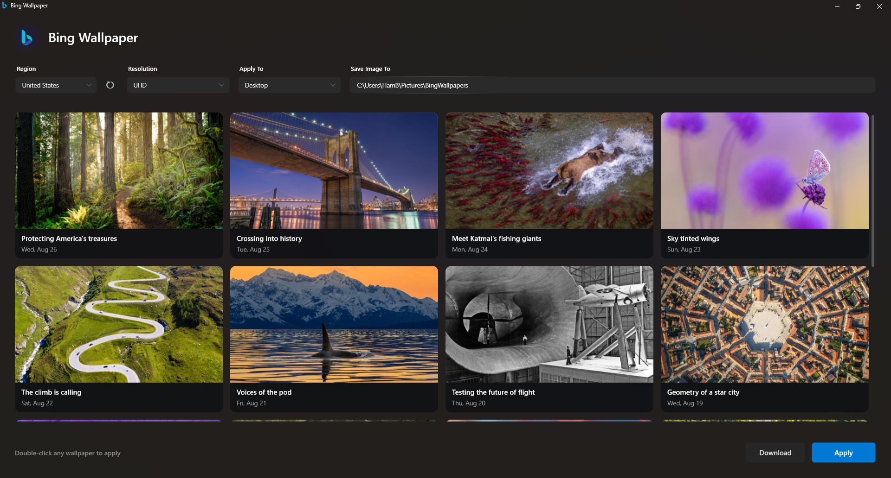

# Bing Wallpaper for Windows

> A deliberately native, low-overhead Windows wallpaper utility for people who want Bing's daily images without a heavy desktop app running all day.

This project keeps the UI intentionally simple: one PowerShell script, a small WPF surface, and a tiny launcher. There is no browser shell, background framework, or bundled runtime. The result is a focused tool designed for ultra-low RAM consumption while it is idle, with an optional headless mode for scheduled wallpaper updates.

[](https://www.microsoft.com/windows)
[](https://microsoft.com/PowerShell)
[](#features)
[](LICENSE)
[](#)



## 📦 Download

<a href="https://github.com/Hamisoptimistic/Bing-Wallpaper/raw/main/BingWallpaper.exe?download=1"></a>

The standalone EXE embeds the PowerShell UI and works by itself. No additional files are required.

---

## ✨ Features

- 🪶 **Naive by design**: A straightforward PowerShell + WPF UI with minimal moving parts and no heavyweight application framework.
- 🧠 **Ultra-low RAM footprint**: The app avoids a resident browser engine and can run only when you need to choose or apply a wallpaper.
- 🎨 **Clean Windows 11 UI**: Native dark title bar with rounded corners, a compact gallery, borderless inputs, and slim overlay scrollbars.
- 🚀 **Zero-Console Standalone Launcher (`BingWallpaper.exe`)**: Launches immediately with zero terminal flash and the authentic high-resolution Bing icon.
- 🌍 **Global Country Support**: Browse wallpapers from 50+ international regions (United States, United Kingdom, Japan, Germany, France, India, Australia, etc.) with automatic clean title parsing.
- 🖼️ **Live HD Gallery**: Visual interactive grid previewing recent Bing wallpapers.
- 🖥️ **Multi-Target Personalization**: Apply wallpapers directly to **Desktop**, **Lock Screen**, or **Both**.
- 📐 **Resolution Support**: Choose between **UHD (4K)**, **1080p Full HD**, or **1366×768**.
- 💾 **Dedicated Downloader**: Apply directly from memory cache or save high-res files to your chosen folder.
- ⏱️ **Unified Headless CLI (`-AutoApply`)**: One single unified script for both interactive GUI and background Task Scheduler automation.

---

## 📁 Project Structure

```
WinDesktop-Bing-wallpapers/
│
├── assets/                       # High-resolution icons and vector assets
│   ├── bing-color.svg
│   └── bing.ico
│
├── scripts/                      # Setup and batch helper scripts
│   ├── Change-Bing-Wallpaper.bat
│   ├── Create-Bing-App-Shortcut.ps1
│   └── Open-Bing-Wallpaper-UI.bat
│
├── .gitignore                    # Git ignore rules
├── BingWallpaper.exe             # Standalone zero-console launcher with embedded icon
├── Bing-Wallpaper-UI.ps1         # Unified application (GUI & CLI -AutoApply)
├── LICENSE                       # MIT License
└── README.md                     # Documentation
```

---

## 🚀 Usage

### 1. Interactive GUI App
Double-click **`BingWallpaper.exe`** (or the **`Bing Wallpaper`** desktop shortcut) to launch the GUI.

### 2. Automated Daily Background Execution (Task Scheduler)
To have Windows automatically update your wallpaper in the background every day without opening the UI:

1. Open **Task Scheduler** (`Win + R` ➔ `taskschd.msc`).
2. Click **Create Basic Task…** and name it `Daily Bing Wallpaper`.
3. Set Trigger to **Daily** (e.g., at 9:00 AM).
4. Set Action to **Start a program**:
   - **Program/script**: `powershell.exe`
   - **Add arguments**:
     ```text
     -NoProfile -ExecutionPolicy Bypass -WindowStyle Hidden -File "C:\Path\To\Bing-Wallpaper-UI.ps1" -AutoApply -Region "en-US" -Resolution "UHD"
     ```
5. Click **Finish**.

### 3. Re-create Desktop Shortcut
To create or refresh the desktop shortcut:
```powershell
powershell -ExecutionPolicy Bypass -File "scripts\Create-Bing-App-Shortcut.ps1"
```

---

## 🔒 Security & Reliability

- **Modern TLS Protocols**: Enforced TLS 1.3 / 1.2 negotiation (`[Net.SecurityProtocolType]::Tls12 -bor Tls13`).
- **Safe URI & Path Validation**: Strict regex character stripping and path traversal protection.
- **No Elevated Privileges**: Runs 100% in user-space without requiring Administrator rights.

---

## 📜 License

This project is licensed under the [MIT License](LICENSE).
Images downloaded through this utility are copyrighted by Microsoft and their respective photographers.
